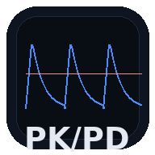

<p align="center">
  
</p>

<h1 align="center">Simulador PK/PD de Antimicrobianos</h1>

<p align="center">
  <strong>Ferramenta educacional interativa para simulação farmacocinética de antimicrobianos hospitalares</strong>
</p>

<p align="center">
  
  
  
  
  
  
  
</p>

<p align="center">
  <a href="https://rodrigoplcosta.github.io/PKPD_simulator/"><strong>Acessar o Simulador (Live Demo)</strong></a>
</p>

---

## Sobre o projeto

Simulador farmacocinético interativo de antimicrobianos hospitalares, desenvolvido como ferramenta educacional para médicos, farmacêuticos, residentes e estudantes da área de saúde.

Calcula e exibe graficamente a curva de concentração sérica ao longo do tempo para **23 antimicrobianos** de **11 classes**, usando um modelo farmacocinético monocompartimental IV. Permite visualizar em tempo real como alterações na dose, intervalo, tempo de infusão e função renal impactam os parâmetros PK/PD preditores de eficácia clínica.

**Autor:** Rodrigo Pinheiro Leal Costa · 2026

---

## Estado atual da interface

A migração visual para Material Design 3 está em andamento.

- **Sprint 0 concluído:** harness de testes de UI com `vitest` + `jsdom`, boot da aplicação real em ambiente DOM simulado e smoke tests do shell atual.
- **Sprint 1 concluído:** fundação MD3 com tokens tonais, tema claro/escuro baseado em contrato semântico, escala tipográfica revisada e integração do gráfico ao novo tema.
- **Ainda não implementado:** shell MD3 completo, chips/listas MD3, reorganização da narrativa clínica e bottom sheet mobile dedicado.

---

## Modelo farmacocinético

O motor de simulação utiliza um modelo monocompartimental de infusão IV intermitente:

- **Fase de infusão:** C(t) = (R0 / ke·Vd) × (1 - e^(-ke·t)), onde R0 = dose/tempo de infusão
- **Fase pós-infusão:** C(t) = C(end) × e^(-ke·(t - tInf))
- **Ajuste renal:** a meia-vida é recalculada pela fração de eliminação renal e a TFG do paciente: t1/2adj = ln2 / (ke × (fr × GFR/120 + (1 - fr)))

A simulação gera pontos de concentração total e livre (fração não-ligada = 1 - ligação proteica) a cada 0.05h (ou 0.25h para teicoplanina), ao longo de 48h (168h para teicoplanina).

### Parâmetros PK/PD calculados

| Parâmetro | Descrição | Alvo clínico |
|-----------|-----------|---------------|
| **fT > MIC (SS)** | Fração do intervalo posológico no steady-state em que a concentração livre supera o MIC | Alvo primário para beta-lactâmicos |
| **AUC24/MIC** | Razão da área sob a curva em 24h pelo MIC | Vancomicina 400–600 (IDSA 2020), linezolida, polimixina B |
| **fCmax/MIC** | Razão do pico de concentração livre pelo MIC | Aminoglicosídeos >= 8–10 |
| **Cmin (vale)** | Concentração mínima no steady-state | Teicoplanina 15–30 mg/L |

---

## Antimicrobianos disponíveis (23 drogas, 11 classes)

| Classe | Fármacos |
|--------|----------|
| Carbapenens | Meropenem, Imipenem, Ertapenem |
| Cefalosporinas | Cefepima, Ceftazidima, Ceftazidima-Avibactam, Ceftriaxona |
| Penicilinas | Piperacilina-Tazobactam, Ampicilina-Sulbactam, Oxacilina |
| Glicopeptídeos | Vancomicina, Teicoplanina |
| Aminoglicosídeos | Amicacina, Gentamicina |
| Lipopeptídeo | Daptomicina |
| Oxazolidinona | Linezolida |
| Polimixina | Polimixina B |
| Nitroimidazol | Metronidazol |
| Fluoroquinolonas | Levofloxacino, Ciprofloxacino |
| Antifúngicos | Anfotericina B Lipossomal, Voriconazol, Fluconazol |

---

## Funcionalidades

- **Seleção rápida de dose:** botões com apresentações comerciais relevantes por fármaco.
- **Intervalos discretos:** botões de intervalo posológico contextuais (ex: q4h, q6h, q8h).
- **Presets de infusão:** bolus, infusão estendida e contínua, contextuais por droga.
- **Dose por peso:** drogas dosadas por mg/kg recalculam automaticamente ao alterar o peso, com sincronização visual após cenários clínicos.
- **Dose de ataque:** seção colapsável opcional, expandida automaticamente quando a droga usa loading dose.
- **Ajuste renal:** classificação automática da TFG (ARC, Normal, DRC G2–G5, Diálise) com recomendações contextuais.
- **Cenários clínicos:** presets rápidos de regimes relevantes.
- **Comparação de regimes:** salve uma curva como referência e compare visualmente com o regime atual.
- **Gráfico interativo:** Chart.js com labels de Cmax/Cmin, destaque fT>MIC, shading de AUC, dose markers e eixo Y ajustado para comparação, incerteza e target lines.
- **Painel educacional:** informações clínicas, limitações do modelo e referências contextuais por droga/classe.
- **Tema claro/escuro:** alternância de tema com contrato MD3 consistente entre UI e gráfico.
- **Fundação MD3:** tokens tonais, superfícies semânticas e escala tipográfica base para as próximas etapas da migração.
- **Undo (Ctrl+Z):** desfazer a última alteração de parâmetro.
- **PWA offline:** manifest e service worker prontos para instalação local.

---

## Tecnologia

| Componente | Detalhes |
|------------|----------|
| **Arquitetura** | ES Modules com Vite 6 |
| **Gráficos** | Chart.js 4.4.1 (CDN) |
| **Tema** | Tokens CSS semânticos em Material Design 3 (`tokens.css` + `theme.css`) |
| **Tipografia** | Google Fonts — DM Sans + JetBrains Mono |
| **Testes** | Vitest para domínio, integração e UI DOM com `jsdom` + Testing Library |
| **CI/CD** | GitHub Actions — test -> build -> deploy GitHub Pages |
| **PWA** | Service Worker para uso offline |
| **Responsivo** | Desktop (sidebar + gráfico) e mobile (drawer inferior) |

---

## Estrutura do projeto

```text
PKPD_simulator/
├── index.html
├── vite.config.js
├── vitest.config.js
├── package.json
├── package-lock.json
├── README.md
├── CHANGELOG.md
├── CONTRIBUTING.md
├── planning.md
├── public/
│   ├── manifest.json
│   ├── sw.js
│   └── icons/
├── src/
│   ├── main.js
│   ├── drugs/
│   │   ├── index.js
│   │   ├── educContent.js
│   │   └── *.json
│   ├── engine/
│   │   ├── pkEngine.js
│   │   ├── pkpdTargets.js
│   │   └── renalAdjust.js
│   ├── ui/
│   │   ├── controls.js
│   │   ├── chart.js
│   │   ├── theme.js
│   │   └── educPanel.js
│   └── styles/
│       ├── tokens.css
│       ├── theme.css
│       ├── base.css
│       ├── chart.css
│       └── controls.css
├── tests/
│   ├── pkpd.test.js
│   ├── integration.test.js
│   ├── setup/
│   │   └── setupTests.js
│   └── ui/
│       ├── app-shell.test.js
│       ├── navigation-smoke.test.js
│       ├── theme.test.js
│       ├── theme-contract.test.js
│       ├── tokens.test.js
│       ├── typography.test.js
│       └── helpers/
│           └── renderApp.js
└── .github/
    └── workflows/
        └── deploy.yml
```

---

## Desenvolvimento local

```bash
# Clonar o repositório
git clone https://github.com/RodrigoPLCosta/PKPD_simulator.git
cd PKPD_simulator

# Instalar dependências
npm install

# Servidor de desenvolvimento
npm run dev

# Rodar toda a suíte
npm test

# Build de produção
npm run build

# Preview do build
npm run preview
```

### Testes de UI

A suíte de UI monta o shell real da aplicação em `jsdom` e usa Testing Library para validar contratos de apresentação e interações básicas.

Cobertura atual:

- `tests/ui/app-shell.test.js`: smoke test do shell atual.
- `tests/ui/navigation-smoke.test.js`: abertura e fechamento do drawer mobile atual.
- `tests/ui/theme.test.js`: alternância de tema e atualização de `meta[name="theme-color"]`.
- `tests/ui/theme-contract.test.js`: propagação do tema para o gráfico sem quebrar o shell.
- `tests/ui/tokens.test.js`: presença dos tokens obrigatórios claro/escuro.
- `tests/ui/typography.test.js`: aplicação da escala tipográfica nas regiões críticas.

---

## Instalação como PWA

**iPhone (Safari):** abra o site -> Compartilhar -> "Adicionar à Tela de Início"

**Android (Chrome):** abra o site -> banner automático ou menu -> "Instalar aplicativo"

Após a instalação, o app pode funcionar offline com os assets locais e o service worker.

---

## Referências bibliográficas

Parâmetros farmacocinéticos populacionais validados contra literatura:

- Craig WA. Pharmacokinetic/pharmacodynamic parameters: rationale for antibacterial dosing of mice and men. *Clin Infect Dis*. 1998;26(1):1-10.
- Drusano GL. Antimicrobial pharmacodynamics: critical interactions of 'bug and drug'. *Nat Rev Microbiol*. 2004;2(4):289-300.
- Roberts JA, Lipman J. Pharmacokinetic issues for antibiotics in the critically ill patient. *Clin Pharmacokinet*. 2009;48(2):89-124.
- Mouton JW, Vinks AA. Pharmacokinetic/pharmacodynamic modelling of antibacterials in vitro and in vivo using bacterial growth and kill kinetics. *Clin Pharmacokinet*. 2005;44(2):201-210.
- Nicolau DP. Optimizing outcomes with antimicrobial therapy through pharmacodynamic profiling. *J Infect Chemother*. 2003;9(4):292-296.
- Rybak MJ et al. Therapeutic monitoring of vancomycin for serious methicillin-resistant *Staphylococcus aureus* infections: a revised consensus guideline. *Am J Health-Syst Pharm*. 2020;77(11):835-864.
- Hanai Y et al. Optimal trough concentration of teicoplanin for the treatment of MRSA infections. *J Antimicrob Chemother*. 2022.
- Wilson AP. Clinical pharmacokinetics of teicoplanin. *Clin Pharmacokinet*. 2000;39(3):167-183.
- Pais GM et al. Polymyxin B dosing in renal impairment. *Pharmacotherapy*. 2022.
- Sandri AM et al. Population pharmacokinetics of intravenous polymyxin B. *Clin Infect Dis*. 2013;57(4):524-531.
- Dvorchik B et al. Daptomycin pharmacokinetics and safety following administration of escalating doses once daily. *J Clin Pharmacol*. 2003;43(6):612-620.
- Stalker DJ, Jungbluth GL. Clinical pharmacokinetics of linezolid. *Clin Pharmacokinet*. 2003;42(13):1129-1140.
- Barclay ML et al. Adaptive resistance to tobramycin in *Pseudomonas aeruginosa*. *J Antimicrob Chemother*. 1996;37(2):253-263.
- Taccone FS et al. Revisiting the loading dose of amikacin for patients with severe sepsis and septic shock. *Crit Care*. 2010;14(2):R53.
- Forrest A et al. Pharmacodynamics of intravenous ciprofloxacin in seriously ill patients. *Antimicrob Agents Chemother*. 1993;37(5):1073-1081.
- Lepak AJ, Andes DR. Antifungal pharmacokinetics and pharmacodynamics. *Cold Spring Harb Perspect Med*. 2015;5(5):a019653.

---

## Como citar

Se você utilizar este simulador em atividades acadêmicas ou educacionais, por favor cite:

```bibtex
@software{costa2026pkpd,
  author    = {Costa, Rodrigo Pinheiro Leal},
  title     = {Simulador PK/PD de Antimicrobianos: ferramenta interativa para simulação farmacocinética hospitalar},
  version   = {1.3},
  year      = {2026},
  url       = {https://rodrigoplcosta.github.io/PKPD_simulator/},
  note      = {Ferramenta educacional — não substitui avaliação clínica individualizada}
}
```

**ABNT:**
COSTA, Rodrigo Pinheiro Leal. **Simulador PK/PD de Antimicrobianos**: ferramenta interativa para simulação farmacocinética hospitalar. Versão 1.3. 2026. Disponível em: https://rodrigoplcosta.github.io/PKPD_simulator/

---

## Limitações do modelo

> **Este simulador é uma ferramenta educacional e não substitui avaliação clínica individualizada nem monitoramento terapêutico de drogas (TDM).**

O motor de simulação utiliza um **modelo monocompartimental** de infusão IV intermitente com parâmetros populacionais de adultos. Isso implica limitações relevantes:

- **Volume de distribuição (Vd) fixo:** o simulador utiliza um Vd populacional único (L/kg), mas na prática clínica o Vd varia amplamente entre pacientes.
- **Fase de distribuição (alfa) não modelada:** para drogas bicompartimentais, o Cmax pós-infusão pode ser superestimado.
- **Ligação proteica constante:** o modelo assume ligação proteica fixa, o que pode divergir de contextos de hipoalbuminemia.
- **Clearance aumentado (ARC):** o simulador permite ajuste de GFR, mas não modela a variabilidade intra-individual ao longo do tempo.
- **Obesidade:** não calcula peso ajustado para aminoglicosídeos nem peso ideal para outras classes.
- **Populações especiais:** não validado para neonatos, crianças, gestantes, ECMO, CRRT ou diálise intermitente.

Para decisões clínicas, recomenda-se TDM com software Bayesiano e avaliação individualizada por farmacêutico clínico ou equipe de stewardship.

---

## Licença

Este projeto está licenciado sob a [MIT License](LICENSE).

---

<p align="center">
  <strong>Aviso:</strong> Simulador educacional — não substitui avaliação clínica individualizada e monitoramento terapêutico de drogas (TDM).
</p>
